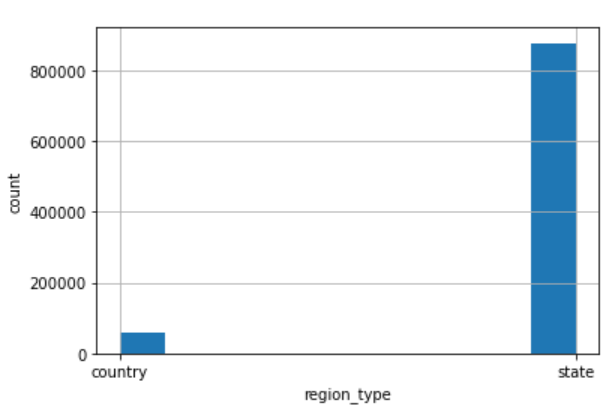

# BirdDistribution-DataVisualization
## Link to our website
https://com-480-data-visualization.github.io/datavis-project-2022-_rmrf/
## Dataset discription
The dataset we used is from [eBird](https://ebird.org/home), an online bird observation database with real-time bird distribution and abundance data. The data on the eBird database is collected from millions of birdwatchers all over the world and managed by [Cornell Lab of Ornithology](https://www.birds.cornell.edu/home). "Data quality is of critical importance. When entering sightings, observers are presented with a list of likely birds for that date and region. These checklist filters are developed by some of the most knowledgeable bird distribution experts in the world." As quoted from the eBird website, the data is reviewed by many bird experts, and a recommended python/R code is used to analyze the data.
The fields of our data include items are as follows:
* Biological information: Common name, Scientific name, etc
* Range and abundance: Mean Abundance, Total_pop_percent, Range_total_percent, Range_days_occupation etc
* Location: Region, Latitude, Longitude, Is a  Bird Conservation Region, etc

For more detailed information, please look at the "Data Description". 

## Motivation
Given the dataset, we are quite interested to show the general distributions and migration behavior of different species of birds. 

To be more specific, we intend to focus on several species and to visualize their distributions over area and its change over time worldwidely, by combining data of birds in different regions and their population and abundance statistics, which will give us a very intuitive picture. Since there are also data describing different types of periods for birds, e.g., breeding, breeding_migration, postbreeding_migration, it’s also possible to exhaust some specific moving patterns of birds by visualizing these data. For example, we are able to find how one specific type of bird migrates before and after breeding sessions, where they are most of the time in one year and so on. 

This project is intended for bird lovers, teenage magazines targeted at those who are fascinated by nature, and also birds researchers. 

## Basic Statistics 
We analyze the meaning and unique values shown up in some attributes. There are **17** different attributes in this dataset in total. 

* species_code: Unique alphanumeric code, usually six-letters, used to identify the species in the eBird database and these codes are used in most URLs from eBird, including eBird Status & Trends products.

* taxon_order: The numeric value assigned to this taxon in the eBird/Clements taxonomy to arrange the species in the latest taxonomic sequence. 

* common_name : The primary English common name of the species in the eBird/Clements taxonomy. 

* scientific_name : The scientific name of the species in the eBird/Clements taxonomy. 

The above four attributes form a unique key for a specific bird and we find that there are **1009** different values of these four attributes except Taxon_order, which indicates that there are **1009** different kinds of birds given in this dataset. 

* region_type: Two possible values, either country or state (subregion). 

* region_code: The alphanumeric code of the country or state. 

* region_name: The name of the country or state. 

These three attributes allocate the locations of birds worldwidely. 

* season_name: The name of the season with the following possible values, breeding, nonbreeding, postbreeding_migration, prebreeding_migration, or year_round. Each season definition is unique to the species and defined through expert review. 

* start_dt : The start date for the season in ISO format (i.e. YYYY-MM-DD).

* end_dt : The end date for the season in ISO format (i.e. YYYY-MM-DD).

* range_days_occupation : Days of occupation is calculated as the number of days that a species occupies the selected region, with occupation being defined as spatially covering the selected region by at least 10% based on estimated relative abundances averaged across the given season.

These four attributes specify the time or the period types when extracting the data. 

* abundance_mean : The average (mean) estimated relative abundance within the selected region for a given season.

* total_pop_percent : This percentage is calculated as the sum of the estimated relative abundance within the selected region divided by the sum of the estimated relative abundance, given that a majority of a species' entire range has been modeled for a particular season.

* range_percent_occupied : The percentage of the selected region within the range boundary of a species for a given season.

* range_total_percent : This percentage is calculated as the fraction of a species' total range that falls within the selected region, given that a majority of that species' range has been modeled for a particular season.

The four attributes above are the distribution data which are our main concerns for our visualization project. 

For the demonstration purpose, we select the bird with the most abundant data. According to our analysis, column **651167** with the species_code “barswa”, common name “Barn Swallow” and scientific name “Hirundo rustica” appears to show most frequently with the total shown up counts **12474**. Therefore, we choose to visualize the distribution and migration pattern with bird “barswa”.
We also notice that the number of states is overwhelming over the country, which will give us a precise depiction of bird distributions. 

And there is also more data showing different periods in a year which will enable us to visualize the migration pattern more easily.

We also make some demonstrations about distributions geometrically. 

This image shows the distribution of Barn Swallows in the breeding season.

## Related work
Some visualization works have already been done.
1. http://globeofbirdmigration.com/
2. http://enram.github.io/bird-migration-flow-visualization/viz/index.html
3. https://news.cornell.edu/stories/2020/03/ornithology-lab-releases-high-resolution-migration-maps

All visualization projects listed here are animations to show bird migration either by points moving towards a specific direction or distribution change.  Our project prefers to visualize the data in an interactive way to attract people to explore the bird migration.
